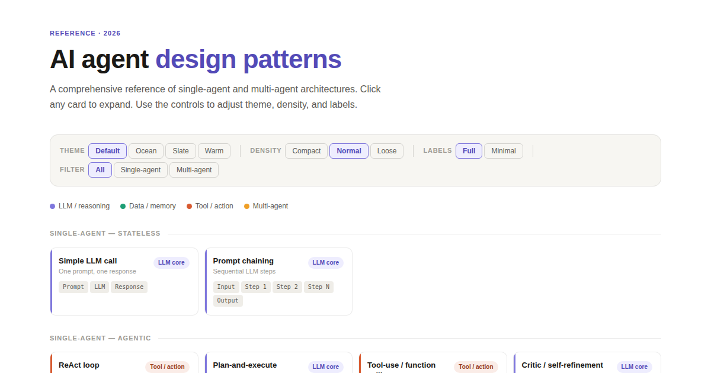

# AI Agent Design Patterns

[](https://github.com/hefrock/ai-agent-patterns/actions/workflows/deploy.yml)

**Live site:** https://hefrock.github.io/ai-agent-patterns/ <!-- placeholder until GitHub Pages is enabled (Settings → Pages → Deploy from branch → main / root) -->

An interactive reference of AI agent design patterns — single-agent and
multi-agent architectures — covering 18 patterns across 8 sections. Built as
a single self-contained `index.html` with no build step and no external
dependencies. Click any card to expand it and see a colored flow diagram,
its description, common uses, and at-a-glance metadata (complexity, agent
count, loop type, statefulness — hover any statefulness value for an
explanation). The "Deep dive" button copies a ready-to-paste prompt
(pattern name, description, flow, and common uses) to your clipboard for
following up in a Claude conversation.

The same `index.html` is the source of truth for every other export format
in this repo (LinkedIn images, PPTX slides, PDF, per-pattern SVGs) — all of
them render directly from the `PATTERNS` array defined in that file.


<!-- Static snapshot for GitHub's README renderer. Regenerate with
     `npm run export:images && cp exports/linkedin-all.png docs/preview.png`
     after a visual change to the site. -->

## Patterns

### Single-agent — stateless
- **Simple LLM call** — One prompt, one response
- **Prompt chaining** — Sequential LLM steps
- **Parallelization** — Concurrent subtasks, then merge

### Single-agent — agentic
- **ReAct loop** — Reason · act · observe
- **Plan-and-execute** — Separate planner and executor
- **Tool-use / function calling** — LLM with tool registry
- **Critic / self-refinement** — Generator + critic loop
- **Tree of Thoughts** — Explore, evaluate, backtrack

### Single-agent — memory
- **RAG pattern** — Retrieve then reason
- **Agentic RAG** — Iterative retrieve, reason, refine
- **Memory-augmented agent** — Short, long & episodic memory

### Single-agent — reactive
- **Event-driven / reactive** — Trigger-based activation

### Multi-agent — cooperative
- **Orchestrator-worker** — Fan-out · fan-in
- **Sequential pipeline** — Specialist handoff chain
- **Cooperative multi-agent** — Shared workspace

### Multi-agent — competitive
- **Competitive / debate** — Independent agents, evaluator selects

### Multi-agent — hierarchical
- **Hierarchical multi-tier** — Strategic → tactical → execution

### Multi-agent — routing
- **Router / mixture of experts** — Intent-based dispatch

## Running the export scripts

The export scripts read pattern data directly out of `index.html` (via a
headless browser) so there is only ever one copy of the content.

```bash
npm install
npx playwright install chromium

npm run validate         # checks PATTERNS against the schema in CLAUDE.md
npm run export:images    # exports/linkedin-{all,single,multi}.png + exports/card-{slug}.png
npm run export:pptx      # exports/ai-agent-patterns.pptx
npm run export:pdf       # exports/ai-agent-patterns.pdf
npm run export:svg       # exports/svg/pattern-{slug}.svg — standalone, no external CSS
```

`npm run validate` and all four export scripts also run on every pull
request via `.github/workflows/ci.yml`, so a malformed pattern or a
renderer crash is caught before merge.

## Project structure

```
ai-agent-patterns/
├── index.html                       ← main interactive site (source of truth)
├── CLAUDE.md                        ← project spec for Claude Code
├── README.md
├── docs/
│   └── preview.png                  ← committed screenshot for this README
├── exports/                         ← generated by the scripts below, gitignored
│   ├── linkedin-all.png
│   ├── linkedin-single.png
│   ├── linkedin-multi.png
│   ├── card-*.png
│   ├── ai-agent-patterns.pptx
│   ├── ai-agent-patterns.pdf
│   └── svg/pattern-*.svg
├── scripts/
│   ├── validate-patterns.js
│   ├── export-images.js
│   ├── export-pptx.js
│   ├── export-pdf.js
│   └── export-svg.js
└── .github/workflows/
    ├── deploy.yml                  ← GitHub Pages deploy action
    └── ci.yml                      ← PR validation (schema + export smoke test)
```

## License

MIT
